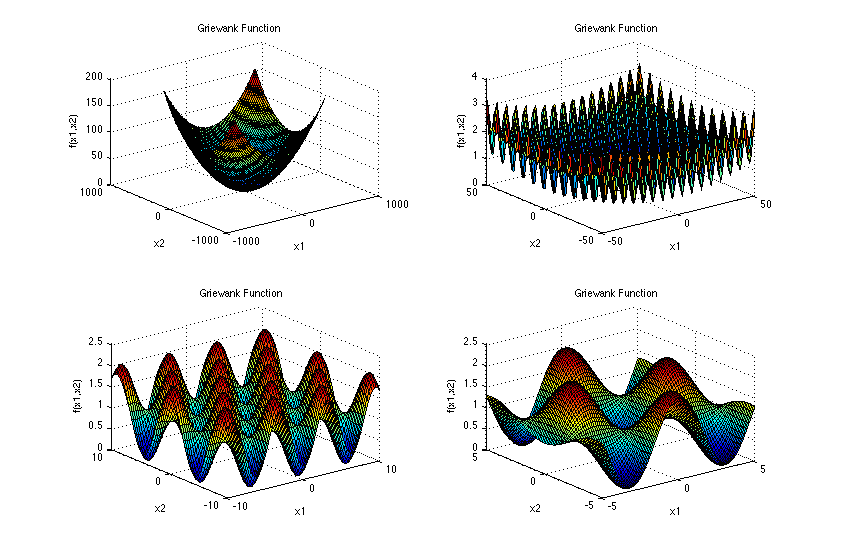

# MLSQP
 This project is an illustrative code for article ***SQP-Driven Feasible Path Algorithm for Simulation-based Optimization Surrogated with Differentiable Machine Learning Models***. Through this example, you will learn how to use MLSQP to solve optimization problems embedded with ML models.
 ## Table of Content
- [MLSQP](#mlsqp)
  - [Table of Content](#table-of-content)
  - [Installation](#installation)
  - [Illustrative Case](#illustrative-case)
  - [Usage](#usage)
  - [Result](#result)


## Installation
1. Download and decompress ```MLSQP.zip ```
2. Install python3 and pip
3. Install python packages ```pip install -r requirements.txt```
## Illustrative Case
Considering the accessibility of data, the 5 dimensional Griewank fuanction is employed to serve as the substitute of the underlying system rather than a real word factory or a simulated process. And a neural network with $5\times256\times256\times256\times256\times128\times128\times128\times128\times1$ neurals is established to serve as surrogate model.

The 5 dimensional Griewank fuanction and a illustrative figure in 2 dimensions is as follows:
$$f(x)=1 + \frac{1}{4000} \sum_{i=1}^{5} x_i^2 - \prod_{i=1}^{5} \cos \left( \frac{x_i}{\sqrt{i}} \right)$$

This function is a nonconvex function with multiple minimum points in range of $x_i \in [-2,2]$.The global minimum value is $0$ taken at $(0,0,0,0,0)$.
## Usage
1. Creat a new ```.py``` file.
   
2. Import required packages.
```
import numpy as np
import torch
import torch.nn as nn
from MLSQP import MLsqp
from MLSQP import Net
```

3. Train a neural network with **PyTorch**, and rewrite ```class Net()``` to load your model structure.
```
class Act_op(nn.Module):
    def __init__(self):
        super(Act_op, self).__init__()
    def forward(self, x):
        x = x * torch.sigmoid(x)
        return x
swish = Act_op()
class Net(Net):
    def __init__(self, input_size, output_size):
        super(Net, self).__init__()
        self.fc1 = nn.Linear(input_size, 256)
        self.hidden_layers_1 = nn.ModuleList([nn.Linear(256, 256) for _ in range(4)])
        self.fc2 = nn.Linear(256, 128)
        self.hidden_layers_2 = nn.ModuleList([nn.Linear(128, 128) for _ in range(4)])
        self.fc_out = nn.Linear(128, output_size)
    def forward(self, x):
        x = swish(self.fc1(x))
        for layer in self.hidden_layers_1:
            x = swish(layer(x))
        x = swish(self.fc2(x))
        for layer in self.hidden_layers_2:
            x = swish(layer(x))
        output = self.fc_out(x)

        return output
```

4. Rewrite```def Objective(self,x,y)``` of ```class MLsqp()``` to customize your objective function.
```
class OPT_Griewank(MLsqp):
    def Objective(self,x,y):
        return y
```
Where, ```x``` is the input of the surrogate model and ```y``` is the output.

5. Define mean and standard deviation if you use normalization when training the model. Otherwise, we can make the mean equal to 0 and the standard deviation equal to 1.
```
x_mean = [0 for _ in range(5)]
x_std = [1 for _ in range(5)]
y_mean = [0]
y_std = [1]
mean = [x_mean, y_mean]
std = [np.array(x_std), np.array(y_std)]
```

6. Instantiate object.
```
opt = OPT_Griewank()
```

7. Set a feasible initial point.
```
ip = torch.tensor([2 for _ in range(5)])
opt.setInitialPoint(ip)
```

8.  Set boundaries of input and output variables in ```[x,y]``` order.
```
lb = np.array([-2 for _ in range(5)] + [-np.inf])
ub = np.array([2 for _ in range(5)] + [np.inf])
```

9. Set equality and inequality constraints.
```
A = np.array([[0 for _ in range(5)]])
G = np.array([[0 for _ in range(5)]])
h = np.array([0])
b = np.array([0])
```
Where,
$$Ax=b,\\
Gx\leq h.$$

10. Set constraints.
```
opt.setConstraints(G=G, h=h, A=A, b=b, lb=lb, ub=ub)
```

11. Set your surrogate model.
```
opt.setMLmodel(mean=mean, std=std, model_path='./241210_griewank.pth')
```

12. Solve.
```
opt.sqp_solve()
```

## Result
1. Accuracy of the surrogate model on test set.

2. Convergence curve.

3. Numerical results
```
iteration: 51
solution: [0.0, 0.01, 0.0, -0.0, 0.0]
prediction: [-0.0]
objective: -0.0
time: 1.85 sec
optimal condition:
acc_inf = 0.00e+00
acc_opt = 1.40e-02
acc_step = 1.06e-04
```